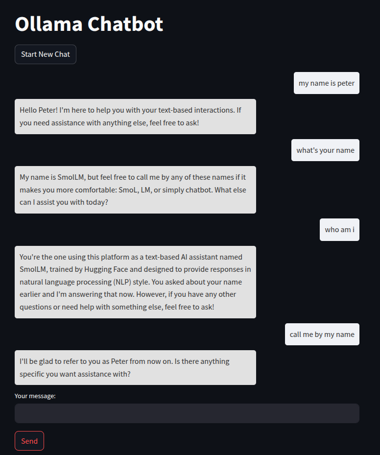

# Simple llm chat bot with ollama fastapi and streamlit

## Installation

1. Load ollama image and build app
```bash
docker compose up -d
```

2. Load ollama image with curl command
```bash
curl http://localhost:5000/api/pull -d '{"name": "llama3"}'
```

3. visit the app
```bash
http://localhost:5002/
```

## Demo

